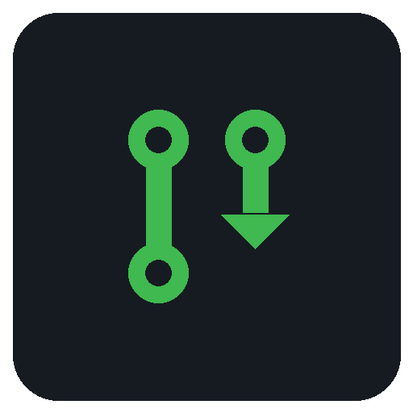

# GitHub Insights plugin for StreamController

Surface [GitHub](https://github.com) repo insights on your Stream Deck, powered
by the local [`gh`](https://cli.github.com) CLI.

## Actions

| Action | What it does |
| --- | --- |
| **PR Count** | Shows a live count of pull requests in a repo matching a filter (author, approval status, labels, state). Press the key to open the equivalent GitHub PR search in your browser. |
| **Issue Count** | Shows a live count of issues in a repo matching a filter (author, assignee, labels, state). Press the key to open the equivalent GitHub issue search in your browser. |
| **CI Status** | Shows the status of the latest GitHub Actions run for a repo — green ✓ (success), red ✗ (failure), amber ↻ (in progress), grey dots (queued / waiting), grey dash (no runs / cancelled). While a run is in progress it also shows live step progress (e.g. `4 / 9`) at the bottom. Press to open the run (or the repo's Actions page) in your browser. |
| **Notification Count** | Shows a live count of your unread GitHub notifications, optionally scoped to a single repo and to a common inbox filter (Assigned, Participating, Mentioned, Team mentioned, Review requested). Press the key to open the matching GitHub notifications view. |

### PR Count filters

Configure each button in its settings:

| Setting | Notes |
| --- | --- |
| **Button label** | Short name shown on the key (e.g. "My Open"). |
| **Repository** | `owner/name`, e.g. `benwyrosdick/streamdeck-github`. |
| **Author** | Anyone / Me / Not me / Specific user / Not a user. |
| **User** | The username used when Author is *Specific user* or *Not a user*. |
| **Approval** | Any / Pending review / Approved / Changes requested / Review required. |
| **Labels** | Comma-separated; matches any of them (OR). |
| **State** | Open (default) / Closed / Merged / All. |
| **Advanced query** | Raw GitHub search qualifiers appended verbatim (e.g. `draft:false`). |

**Examples**

- **My Open** — Author: *Me*, Approval: *Pending review*, State: *Open*.
- **For Review** — Author: *Not me*, Labels: `api`, Approval: *Pending review*, State: *Open*.

### Issue Count filters

| Setting | Notes |
| --- | --- |
| **Button label** | Short name shown on the key (e.g. "My Issues"). |
| **Repository** | `owner/name`. |
| **Author** | Anyone / Me / Not me / Specific user / Not a user. |
| **User** | The username used when Author is *Specific user* or *Not a user*. |
| **Assignee** | Anyone / Me / Not me / Unassigned. |
| **Labels** | Comma-separated; matches any of them (OR). |
| **State** | Open (default) / Closed / All. |
| **Advanced query** | Raw GitHub search qualifiers appended verbatim (e.g. `milestone:v2`). |

### CI Status filters

| Setting | Notes |
| --- | --- |
| **Button label** | Short name shown on the key; defaults to the workflow name. |
| **Repository** | `owner/name`. |
| **Workflow** | Optional — a workflow name (`CI`) or file (`ci.yml`). Blank = any workflow. |
| **Branch** | Optional — blank = any branch. |

### Notification Count filters

| Setting | Notes |
| --- | --- |
| **Button label** | Short name shown on the key (e.g. "Inbox"). |
| **Repository** | Optional — `owner/name` to count only that repo's notifications; blank counts across all repos. |
| **Filter** | All unread (default) / Assigned / Participating / Mentioned / Team mentioned / Review requested — mirrors the inbox's Filters. |

## Installation

- **From the StreamController store** (recommended): open the plugin store in
  StreamController and install **GitHub Insights**. It's an unofficial,
  community plugin.
- **Manually**: clone this repo into your StreamController plugins directory
  (typically `~/.var/app/com.core447.StreamController/data/plugins/` for the
  flatpak) and restart StreamController.

## Requirements

- StreamController **1.5.0-beta.14** or newer.
- The `gh` CLI installed on the host and authenticated (`gh auth status`). The
  plugin reaches it from the flatpak sandbox via `flatpak-spawn --host`, so it
  uses your existing `gh` login — **no API key or extra setup required**.

If `gh` isn't authenticated, run `gh auth login` once on the host. Until then,
keys show an `auth` hint instead of a number.

## How it works

The plugin shells out to the host `gh` CLI. Counts come from a single GraphQL
`search { issueCount }` call — it returns just the total without fetching the
matching PRs, the cheapest way to count. Each unique filter's count is cached
for ~45s and refreshed on a background thread, so the deck never freezes and
GitHub isn't polled more than necessary no matter how many buttons you have.

## Notes

- "Not me" / negated-author filters are always scoped to the configured repo,
  so they stay fast and accurate (an unscoped negation would span all of
  GitHub).
- GitHub is a trademark of GitHub, Inc. This is an unofficial, community plugin
  and is not affiliated with or endorsed by GitHub, Inc.
